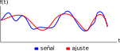

<a href='http://creativecommons.org/licenses/by-nc-sa/3.0/'>
    
</a>

## ¿Por qué usar un enfoque distinto a la regresión lineal?

En el <a href="http://pachamaltese.github.io/analisis-de-datos-unab/complementos/complemento-laboratorio5/complemento-laboratorio5.html">complemento del Laboratorio Nº5</a> y en el <a href="http://pachamaltese.github.io/analisis-de-datos-unab/laboratorios/laboratorio6/desarrollo-laboratorio6.html">Laboratorio Nº6</a> vimos que en el caso de los datos de la base `appleProdFr86` ninguna de las funciones tiene un ajuste razonable y nos quedamos con la especificación de una función cuadrática por ser la que entrega menos observaciones con productividad marginal negativa.

La estimación cuadrática tiene mejor $\bar{R}^2$ que la translogarítmica pero la forma funcional genera una elasticidad producto-factor negativa. Más aún, en algunos casos la elasticidad de escala será negativa.

Ajustar una función de manera que se obtenga un buen ajuste y las productividades estimadas sean razonables no es simple ya que se deberían probar varios modelos hasta encontrar el más adecuado.

$\Rightarrow$ se puede estimar una regresión no paramétrica que no depende de una forma funcional.

## Regresión no paramétrica
  
Se trabaja con un modelo de la forma 
$$Y_i = m(X_i) + \varepsilon_i$$
  
Ventajas: 
  
* No se define una función a priori
* Se busca la forma funcional de $m$ de mejor ajuste a partir de los datos (e.g. función lineal o polinomial por partes)
* Permite obtener efectos marginales

Desventajas: 
  
* Computacionalmente es más costoso
* No hay coeficientes de regresión (el foco es la función de regresión)
* Difícil de interpretar

### Regresión en una variable

La idea geométrica de lo anterior es lo siguiente:
  
  <center>
  
  </center>
  
Podemos estimar la producción considerando como único regresor el capital. Esto se hará con base en lo ya visto para esta base de datos.
```{r}
require(KernSmooth)
data("appleProdFr86", package = "micEcon")
data <- appleProdFr86

data$qCap <- data$vCap/data$pCap
data$qLab <- data$vLab/data$pLab
data$qMat <- data$vMat/data$pMat

qOut <- as.vector(data$qOut)
qCap <- as.vector(data$qCap)

bw <- dpill(qCap,qOut)
fit1 <- locpoly(qCap, qOut, bandwidth = bw, degree = 1) # forma polinomial de grado 1
plot(fit1$x, fit1$y, type = "l")
```

Es posible probar distintas especificaciones
```{r, fig.width = 10, fig.height = 8}
# forma polinomial de grado 2
fit2.1 <- locpoly(qCap, qOut, bandwidth = bw, degree = 2) 
fit2.2 <- locpoly(qCap, qOut, bandwidth = bw*2, degree = 2) #menos varianza / más sesgo
fit2.3 <- locpoly(qCap, qOut, bandwidth = bw/2, degree = 2) #más varianza / menos sesgo

# regresión lineal habitual
fit.lm <- lm(qOut ~ qCap)

# graficos
plot(fit1$x, fit1$y, type = "l");par(mfrow=c(2,2))
plot(fit1$x, fit1$y, type = "l");lines(fit2.1, col = "blue")
plot(fit1$x, fit1$y, type = "l");lines(fit2.2, col = "red")
plot(fit1$x, fit1$y, type = "l");lines(fit2.3, col = "green")
plot(fit1$x, fit1$y, type = "l");abline(fit.lm, col = "purple")
```

Análisis de los modelos: 
```{r}
# modelo 1
sum(is.na(fit1$y)) # hay observaciones que se indeterminan

# modelos 2, 3 y 4
sum(is.na(fit2.1$y))
sum(is.na(fit2.2$y)) # menos observaciones indeterminadas
sum(is.na(fit2.3$y))
```
$\Longrightarrow$ se debería trabajar a partir del modelo 2.2 y ajustar.

<br>

Pruebo una función con rendimientos crecientes a tasa decreciente (de acuerdo a la teoría neoclásica) y mantengo la banda del modelo 2.2.
```{r}
# se ajusta la banda y el grado
fit.sqrt <- locpoly(qCap, qOut, bandwidth = bw*3, degree = 0.5)
sum(is.na(fit.sqrt$y)) 
sum(fit.sqrt$y < 0)
```
En este modelo todas las observaciones están definidas y son no negativas.

```{r}
plot(fit.sqrt$x, fit.sqrt$y, type = "l")
```

Productividad media:
```{r}
median(fit.sqrt$y)/median(fit.sqrt$x) # cada unidad de capital produce en promedio 18.1 unidades 
```

Si aumento la banda la función se asemeja cada vez más a una función neoclásica con un tramo inicial de rendimientos crecientes a tasa creciente y a partir del punto en que la productividad media es máxima (e igual a la productividad marginal) el rendimiento pasa a ser creciente a tasa decreciente.

```{r}
# se ajusta la banda y el grado
fit.sqrt.2 <- locpoly(qCap, qOut, bandwidth = bw*5, degree = 0.5)
plot(fit.sqrt.2$x, fit.sqrt.2$y, type = "l")
```

Lo que se observa en los últimos gráficos explicaría que pese a haber rendimientos crecientes, si vemos el tamaño de planta (se vio en el complemento anterior) se observa que hay plantas de todos los tamaños con una concentración en un tamaño de planta medio.

### Regresión en varias variables

Una metodología no paramétrica (Epanechnikov) consiste en:
  
* Estimar una regresión para cada observación
* Tomar cada observación de la muestra y asignar ponderadores a todas las demás según que tan lejos o cerca están de la referencia
* Repetir el proceso iterativamente hasta obtener el mejor ajuste
* Aplicar una validación cruzada a la estimación obtenida


Se estimará una regresión no paramétrica con todos los inputs y el output en logaritmos
```{r, eval=TRUE, message=FALSE}
library(np)
prodNP <- npreg(log(qOut) ~ log(qCap) + log(qLab) + log(qMat), regtype = "ll", 
                bwmethod = "cv.aic", ckertype = "epanechnikov",  data = data, 
                gradients = TRUE)
summary(prodNP)
```

###Gráficos ceteris paribus 
Las variables no graficadas se mantienen fijas en un valor igual a su mediana
```{r,echo=FALSE, fig.width=12, fig.height=7}
plot(prodNP, plot.errors.method = "bootstrap")
```

###Test de significancia
```{r, message=FALSE, warning=FALSE}
npsigtest(prodNP)
```
$\Longrightarrow$ con un nivel de significancia de 10% la única variable cuyos efectos son no significativos es el capital.

###Histogramas de elasticidad producto-factor y elasticidad de escala en base a regresión no paramétrica
```{r,echo=FALSE,fig.width=12, fig.height=7}
par(mfrow=c(2,2)); hist(gradients(prodNP)[ ,1], xlab = "Capital", main=NULL); hist(gradients(prodNP)[ ,2], xlab = "Labour", main=NULL); hist(gradients(prodNP)[ ,3], xlab = "Materials", main=NULL); hist(gradients(prodNP), xlab = "Scale", main=NULL)
```

###Relación entre tamaño de planta y elasticidad de escala

```{r,echo=FALSE,fig.width=8, fig.height=6}
plot(data$qOut, rowSums(gradients(prodNP)), log = "x", xlab = "qOut", ylab = "eScaleNP")
```