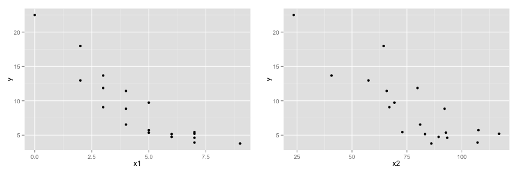

## Pregunta 1
Considere el vector

```r
x <- c(0.18, -1.54, 0.42, 0.95)
```
y los ponderadores

```r
w <- c(2, 1, 3, 1)
```
Encuentre el valor de $\mu$ que minimiza la ecuación de mínimos cuadrados $\Sigma_{i=1}^n w_i(x_i-\mu)^2$. Hágalo de las siguientes formas:

1. Algebraicamente
2. En Excel (descargar <a href="http://pachamaltese.github.io/analisis-de-datos-unab/laboratorios/laboratorio2/laboratorio2-pregunta1.xlsx">datos</a> en Excel)
3. En R

---

## Desarrollo Pregunta 1 (1)

### Algebraicamente

Sea $S = \displaystyle\Sigma_{i=1}^n w_i(x_i-\mu)^2$

$S = \displaystyle\Sigma_{i=1}^n w_i(x_i^2-2x_i\mu+\mu^2)$

$S = \displaystyle\Sigma_{i=1}^n w_ix_i^2 -2\mu\displaystyle\Sigma_{i=1}^n w_ix_i +\mu^2\displaystyle\Sigma_{i=1}^n w_i$

$\displaystyle \frac{dS}{d\mu} = 0 \Leftrightarrow -2\displaystyle\Sigma_{i=1}^n w_ix_i +2\mu^* \displaystyle\Sigma_{i=1}^n w_i = 0$ 

$\displaystyle \frac{dS}{d\mu} = 0 \Leftrightarrow \mu^* = \frac{\Sigma_{i=1}^n w_ix_i}{\Sigma_{i=1}^n w_i}$

--- 

## Desarrollo Pregunta 1 (2)

### Excel
Descargar <a href="http://pachamaltese.github.io/analisis-de-datos-unab/laboratorios/laboratorio2/laboratorio2-desarrollo-pregunta1.xlsx">solución</a> en Excel.

---

## Desarrollo Pregunta 1 (3)

### `R`
El promedio ponderado se obtiene con el siguiente comando

```r
weighted.mean(x, w) # 0.1471
```

```
## [1] 0.1471429
```

---

## Pregunta 2
Considere los siguientes vectores de datos

```r
x <- c(0.8, 0.47, 0.51, 0.73, 0.36, 0.58, 0.57, 0.85, 0.44, 0.42)
y <- c(1.39, 0.72, 1.55, 0.48, 1.19, -1.59, 1.23, -0.65, 1.49, 0.05)
```
Estime una regresión desde el origen y obtenga la pendiente considerando $y$ como la variable dependiente y $x$ como la variable independiente. ¿Cómo cambia su resultado si estima un modelo con constante?

---

## Desarrollo Pregunta 2

Regresión tal que $\beta_0$ pasa por el origen

```r
fit.sc <- lm(y ~ x - 1) #modelo sin constante
coefficients(fit.sc) # 0.8263
```

```
##         x 
## 0.8262517
```

```r
fit.c <- lm(y ~ x) #modelo con constante
coefficients(fit.c) #-1.713
```

```
## (Intercept)           x 
##    1.567461   -1.712846
```

---

## Pregunta 3
Usando la base de datos mtcars estime un modelo que considere mpg como variable dependiente y la weight como variable independiente.

---

## Desarrollo Pregunta 3

```r
data(mtcars) #para cargar la librería en memoria
fit <- lm(mpg ~ wt, mtcars)
coefficients(fit)
```

```
## (Intercept)          wt 
##   37.285126   -5.344472
```

---

## Pregunta 4 (1)

A partir del archivo Excel utilizado en el Laboratorio 1 (<a href="http://pachamaltese.github.io/analisis-de-datos-unab/laboratorios/laboratorio1/laboratorio1.xlsx">laboratorio1.xlsx</a>) obtenga las mismas regresiones (con y sin constante) utilizando R. Para esto siga los siguientes pasos:

### Definir variables en memoria y cargar librerías
  
  * Definir el directorio de trabajo.
  * Instalar una librería que permita leer archivos XLSX. Usaremos XLConnect cuya documentación se puede ver en <a href="https://cran.r-project.org/web/packages/XLConnect/XLConnect.pdf">https://cran.r-project.org/web/packages/XLConnect/XLConnect.pdf</a>.
  
  * Cargar la librería XLConnect.
  * Leer el archivo del Laboratorio 1.
  * Asignar nombres <b>simples</b> a las columnas ($y$, $x_1$, $x_2$).

---

## Pregunta 4 (2)

### Haga un gráfico de cada variable explicativa sobre la explicada 

  * Instalar y cargar en memoria ggplot (librería para graficar)
  * Graficar $y$ versus $x_1$ e $y$ versus $x_2$.
  * Ver la correlación entre las variables.
  
### Calcule el estimador de los parámetros.

  * Hacer una correlación sin constante.
  * Hacer una correlación con constante

---

## Desarrollo Pregunta 4 (1)


```r
#1. Definir variables en memoria y cargar librerías
    #Definir el directorio de trabajo
    dir <- "/Users/pacha/analisis-de-datos-unab/laboratorios/laboratorio1"
    
    #Instalar una librería que permita leer archivos XLSX
    #install.packages("XLConnect")
    
    #Cargar la librería XLConnect
    library(XLConnect)
    
    #Leer el archivo del Laboratorio 1
    file <- paste0(dir,"/laboratorio1.xlsx")
    data <- readWorksheetFromFile(file, sheet = "Hoja1", region = "A2:C20", header = FALSE)

    #Asignar nombres simples a las columnas
    colnames(data) <- c("y", "x1", "x2")
```

---

## Desarrollo Pregunta 4 (2)
  

```r
#2. Haga un gráfico de cada variable explicativa sobre la explicada 
# ¿Hay correlación entre ellas?
    
    #Instalar y cargar en memoria ggplot (librería para graficar)
    #install.packages("ggplot2")
    library(ggplot2)
    
    #Graficar y versus x1 e y versus x2
    qplot(x1, y, data=data)
    qplot(x2, y, data=data)
    
    #Ver la correlación entre las variables
    cor(data)
```

---

## Desarrollo Pregunta 4 (3)

### `qplot(x1, y, data=data); qplot(x2, y, data=data)`
 

---

## Desarrollo Pregunta 4 (4)

### `cor(data)`


```
##             y         x1         x2
## y   1.0000000 -0.8911151 -0.8284953
## x1 -0.8911151  1.0000000  0.7270866
## x2 -0.8284953  0.7270866  1.0000000
```

---

## Desarrollo Pregunta 4 (5)


```r
#3. Calcule el estimador de los parámetros
    
    #Convertir a data.frame y hacer una regresión sin constante
    data <- as.data.frame(data); fit1 <- lm(y ~ x1 + x2 -1, data=data); coefficients(fit1) 
```

```
##         x1         x2 
## -2.0501132  0.2148756
```

```r
    #Hacer una regresión con constante
    fit2 <- lm(y ~ x1 + x2, data=data); coefficients(fit2)
```

```
## (Intercept)          x1          x2 
## 22.22048141 -1.40916785 -0.08606443
```
